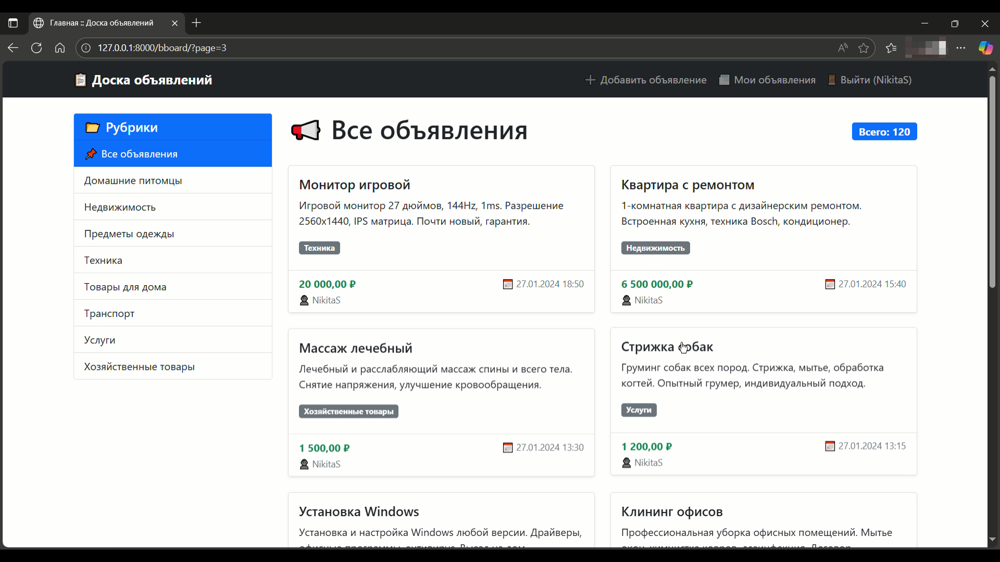
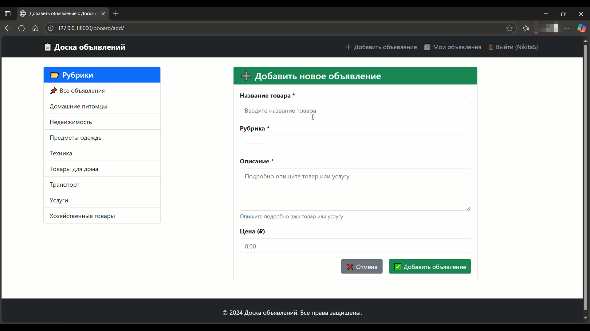
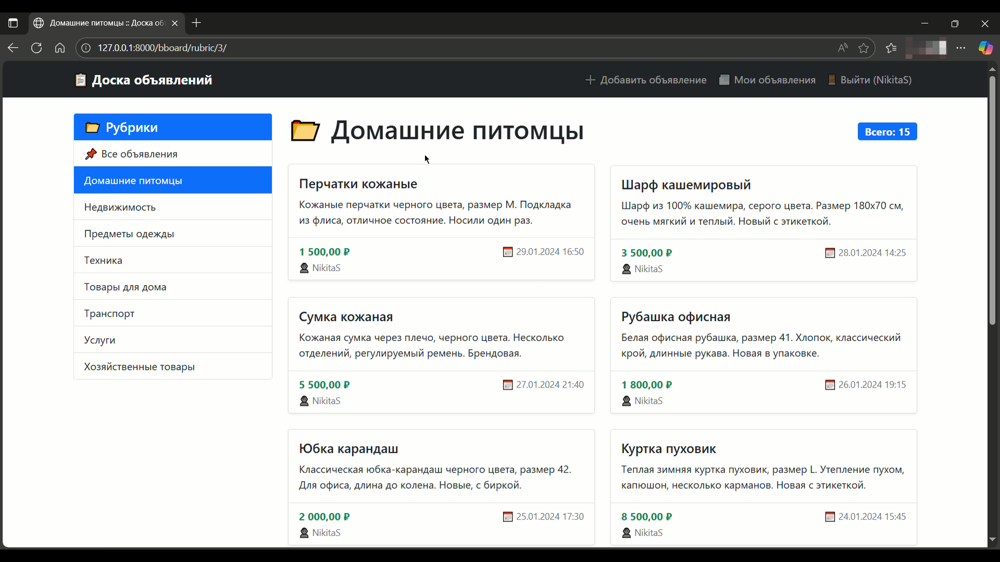
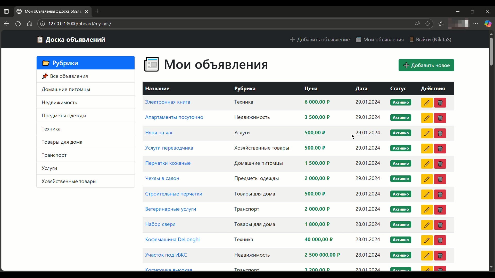

# Доска объявлений (Bboard)

Pet проект Django для размещения и просмотра объявлений с системой рубрик и авторизацией пользователей.

###### Проект был разработан в рамках образовательной программы по изучению фреймворка, основанной на [учебных материалах](https://bhv.ru/product/django-4-praktika-sozdaniya-veb-sajtov-na-python/), подготовленных Дроновым В.А.

## Описание

Веб-приложение на Django, которое позволяет пользователям:
- Просматривать объявления по рубрикам
- Создавать и публиковать свои объявления
- Просматривать детальную информацию об объявлении
- Управлять своими объявлениями

## Функциональность

- ✅ Система рубрик для категоризации объявлений
- ✅ Авторизация и регистрация пользователей
- ✅ Создание объявлений с указанием названия, описания, цены и рубрики
- ✅ Просмотр объявлений с пагинацией
- ✅ Фильтрация объявлений по рубрикам
- ✅ Личный кабинет для управления своими объявлениями
- ✅ Административная панель Django

## Технологии

- **Python 3.8+**
- **Django 4.2.25**
- **SQLite** (база данных)
- **Bootstrap 5** (для стилизации интерфейса, через CDN)

## Установка и запуск

### Требования

- Python 3.8+
- pip

### Шаги установки

1. Клонируйте репозиторий:
```bash
git clone https://github.com/codemed7-git/BillBoard.git
cd BillBoard
```

2. Создайте виртуальное окружение:
```bash
python -m venv venv
```

3. Активируйте виртуальное окружение:

**Windows:**
```bash
venv\Scripts\activate
```

**Linux/Mac:**
```bash
source venv/bin/activate
```

4. Установите зависимости:
```bash
pip install Django==4.2.25
```

5. Примените миграции:
```bash
python manage.py migrate
```

6. Создайте суперпользователя (опционально):
```bash
python manage.py createsuperuser
```

7. Загрузите начальные данные (рубрики):
```bash
python manage.py create_initial_data
```

8. Запустите сервер разработки:
```bash
python manage.py runserver
```

9. Откройте браузер и перейдите по адресу: `http://127.0.0.1:8000/bboard/`

## Структура проекта

```
samplesite/
├── bboard/              # Основное приложение
│   ├── models.py        # Модели данных (Bb, Rubric)
│   ├── views.py         # Представления (views)
│   ├── forms.py         # Формы
│   ├── urls.py          # URL-маршруты
│   └── templates/       # HTML шаблоны
├── samplesite/          # Настройки проекта
│   ├── settings.py      # Конфигурация Django
│   └── urls.py          # Главный URLconf
├── manage.py            # Утилита управления Django
└── README.md            # Документация проекта
```

## Скриншоты

### Главная страница


### Страница добавления объявления


### Детальная страница объявления


### Страница "Мои объявления"


## Использование

### Для пользователей

1. **Регистрация/Вход**: Зарегистрируйтесь или войдите в систему
2. **Просмотр объявлений**: На главной странице доступны все активные объявления
3. **Фильтрация**: Выберите рубрику для просмотра объявлений в конкретной категории
4. **Создание объявления**: Нажмите "Добавить объявление" и заполните форму
5. **Мои объявления**: В разделе "Мои объявления" можно просмотреть все ваши публикации

### Для администраторов

Доступ к административной панели: `http://127.0.0.1:8000/admin/`