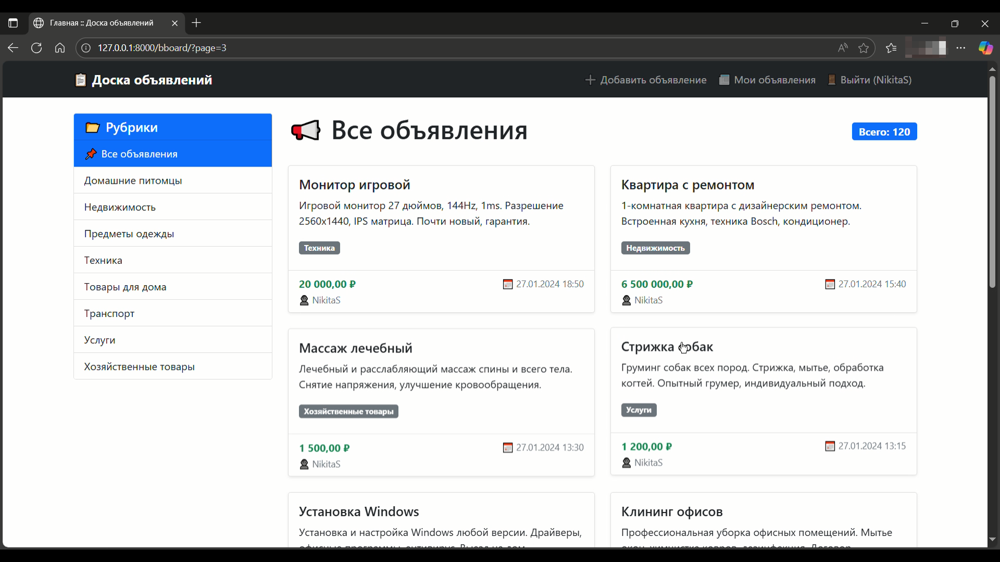
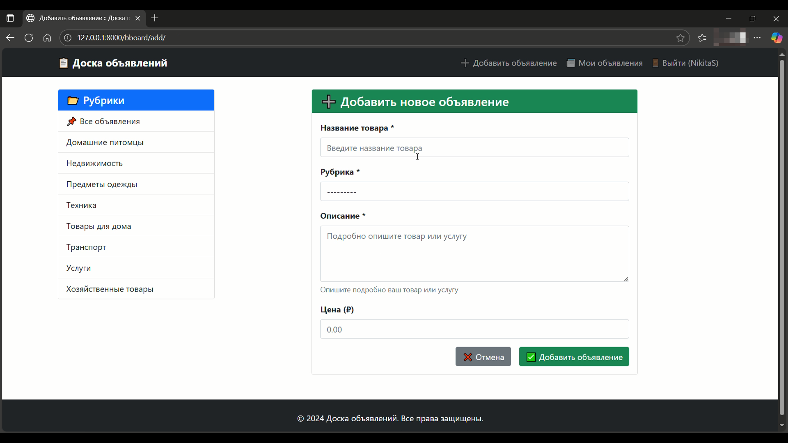
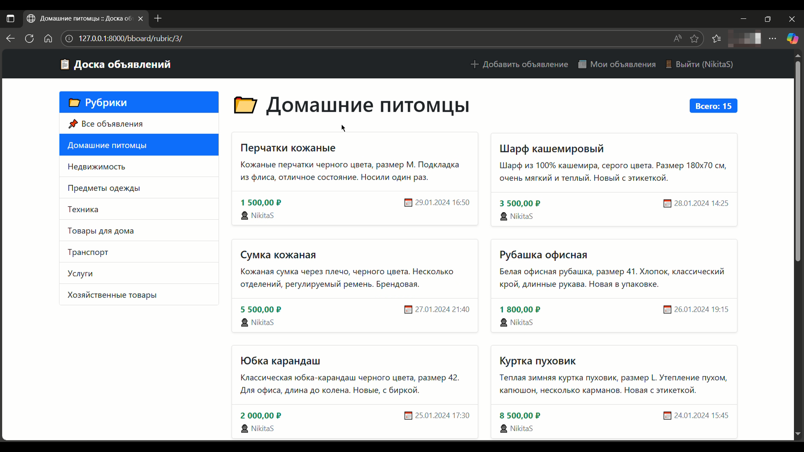
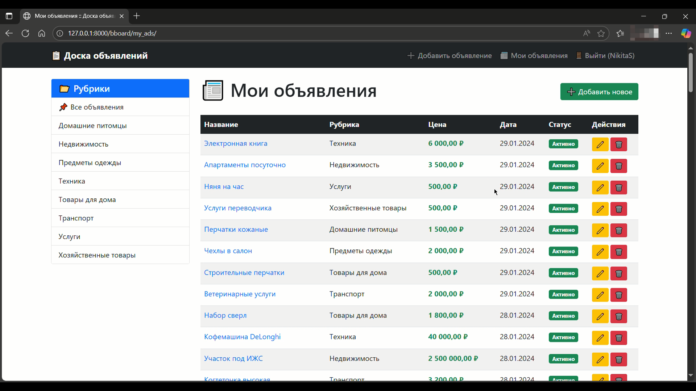

# Доска объявлений BillBoard

Pet проект Django для размещения и просмотра объявлений с системой рубрик и авторизацией пользователей.

###### Проект был разработан в рамках образовательной программы по изучению фреймворка, основанной на [учебных материалах](https://bhv.ru/product/django-4-praktika-sozdaniya-veb-sajtov-na-python/), подготовленных Дроновым В.А.

## Описание

Веб-приложение на Django, которое позволяет пользователям:
- Просматривать объявления по рубрикам
- Создавать и публиковать свои объявления
- Просматривать детальную информацию об объявлении
- Управлять своими объявлениями

## Функциональность

- ✅ Система рубрик для категоризации объявлений
- ✅ Авторизация и регистрация пользователей
- ✅ Создание объявлений с указанием названия, описания, цены и рубрики
- ✅ Просмотр объявлений с пагинацией
- ✅ Фильтрация объявлений по рубрикам
- ✅ Личный кабинет для управления своими объявлениями
- ✅ Административная панель Django

## Технологии

- **Python 3.8+**
- **Django 4.2.25**
- **PostgreSQL** (база данных)
- **Bootstrap 5** (для стилизации интерфейса, через CDN)

## Установка и запуск

### Требования

- Python 3.8+
- pip
- PostgreSQL 12+

### Шаги установки

1. Клонируйте репозиторий:
```bash
git clone https://github.com/codemed7-git/BillBoard.git
cd BillBoard
```

2. Создайте виртуальное окружение:
```bash
python -m venv venv
```

3. Активируйте виртуальное окружение:

**Windows:**
```bash
venv\Scripts\activate
```

**Linux/Mac:**
```bash
source venv/bin/activate
```

4. Установите зависимости:
```bash
pip install -r requirements.txt
```

5. Создайте базу данных PostgreSQL (пример для `psql`):
```bash
createdb billboard_db
```
Или в `psql`: `CREATE DATABASE billboard_db;`

6. Скопируйте файл переменных окружения и при необходимости измените значения:
```bash
copy .env.example .env
```
На Linux/Mac: `cp .env.example .env`

7. Примените миграции:
```bash
python manage.py migrate
```

8. Создайте суперпользователя (опционально):
```bash
python manage.py createsuperuser
```

9. Загрузите начальные данные (рубрики):
```bash
python manage.py create_initial_data
```

10. Запустите сервер разработки:
```bash
python manage.py runserver
```

11. Откройте браузер и перейдите по адресу: `http://127.0.0.1:8000/bboard/`

## Развёртывание на сервере (Docker)

При каждом запуске контейнера `web` автоматически:

1. Ожидает готовность PostgreSQL  
2. Выполняет `python manage.py migrate --noinput`  
3. Собирает статику (`collectstatic`)  
4. При `LOAD_INITIAL_DATA=true` загружает рубрики (`create_initial_data`)  
5. Запускает приложение через Gunicorn  

### Быстрый старт

```bash
cp .env.example .env
# Задайте SECRET_KEY и ALLOWED_HOSTS (домен или IP сервера)
docker compose up --build -d
```

Сайт: `http://<IP сервера>:8000/bboard/`

PostgreSQL поднимается в контейнере `db`; для приложения в compose задаётся `DB_HOST=db`.

### Переменные окружения

| Переменная | Назначение |
|------------|------------|
| `SECRET_KEY` | Секрет Django (обязательно сменить в production) |
| `DEBUG` | `False` на сервере |
| `ALLOWED_HOSTS` | Список доменов/IP через запятую |
| `DB_*` | Подключение к PostgreSQL |
| `LOAD_INITIAL_DATA` | `true` — рубрики при старте; `false` — только миграции |
| `WEB_PORT` | Порт на хосте (по умолчанию 8000) |

### Без Docker (VPS, systemd)

Тот же сценарий можно вызвать вручную или в `ExecStartPre`:

```bash
./entrypoint.sh gunicorn samplesite.wsgi:application --bind 0.0.0.0:8000
```

На сервере укажите в `.env` реальный `DB_HOST` (не `db`, если БД установлена отдельно).

## Развёртывание на Render

Файл `render.yaml` описывает Blueprint: PostgreSQL + web-сервис с автосборкой и миграциями при каждом деплое.

### Что происходит при деплое

| Этап | Команда |
|------|---------|
| Build | `build.sh` — зависимости и `collectstatic` |
| Pre-deploy | `migrate` и `create_initial_data` (рубрики) |
| Start | Gunicorn на порту `$PORT` |

Render сам проставляет `DATABASE_URL`, `RENDER_EXTERNAL_HOSTNAME` и сгенерированный `SECRET_KEY`.

### Подключение репозитория

1. Залейте проект на GitHub (корень репозитория — папка `BillBoard`, где лежит `manage.py`).
2. В [Render Dashboard](https://dashboard.render.com/) → **New** → **Blueprint**.
3. Подключите репозиторий — Render подхватит `render.yaml`.
4. Дождитесь деплоя. Сайт: `https://<имя-сервиса>.onrender.com/bboard/`.

Если репозиторий — монорепозиторий и код в подпапке `BillBoard`, в настройках web-сервиса укажите **Root Directory**: `BillBoard`.

### После первого деплоя

- Админка: `https://<ваш-домен>.onrender.com/admin/`
- Создайте суперпользователя через **Shell** в Render:  
  `python manage.py createsuperuser`  
  Либо используйте учётки из `create_initial_data`: **admin** / **admin123** (админка и сайт), **user** / **27kafthebest** (сайт). Пароли обновляются при каждом запуске `start.sh` на Render.

### Медиафайлы

На Render диск эфемерный: загруженные через сайт файлы в `/media` не сохраняются между перезапусками. Для production-публикаций с картинками нужен внешний storage (S3 и т.п.).

## Структура проекта

```
samplesite/
├── bboard/              # Основное приложение
│   ├── models.py        # Модели данных (Bb, Rubric)
│   ├── views.py         # Представления (views)
│   ├── forms.py         # Формы
│   ├── urls.py          # URL-маршруты
│   └── templates/       # HTML шаблоны
├── samplesite/          # Настройки проекта
│   ├── settings.py      # Конфигурация Django
│   └── urls.py          # Главный URLconf
├── manage.py            # Утилита управления Django
├── Dockerfile           # Образ приложения
├── docker-compose.yml   # PostgreSQL + web с автомиграциями
├── entrypoint.sh        # migrate и старт Gunicorn
├── render.yaml          # Blueprint для Render.com
├── build.sh             # Сборка на Render
└── README.md            # Документация проекта
```

## Скриншоты

### Главная страница


### Страница добавления объявления


### Детальная страница объявления


### Страница "Мои объявления"


## Использование

### Для пользователей

1. **Регистрация/Вход**: Зарегистрируйтесь или войдите в систему
2. **Просмотр объявлений**: На главной странице доступны все активные объявления
3. **Фильтрация**: Выберите рубрику для просмотра объявлений в конкретной категории
4. **Создание объявления**: Нажмите "Добавить объявление" и заполните форму
5. **Мои объявления**: В разделе "Мои объявления" можно просмотреть все ваши публикации

### Для администраторов

Доступ к административной панели: `http://127.0.0.1:8000/admin/`
